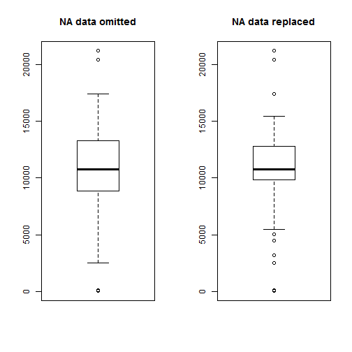

###Reproducible Research Peer Assessment One
* author: Megan Minshew
* date: July 20, 2014
* output: PA1_template.Rmd
* html_document:PA1_template.html


```r
#using libraries:
library(ggplot2)
library(scales)
```

###This analysis is based on activity monitoring data that contains the following elements:
* steps: number of steps recorded during a 5 minute monitoring interval
* date: the date of the monitoring interval
* interval: an identifier for the monitoring interval


```r
#load the activity data
data <- read.csv("activity.csv") #native field names in the csv are meaningful and useable

#change interval to a factor
data$interval <- as.factor(data$interval)
#change date to a date
data$date <- as.Date(data$date)
```
###What is meant by total number of steps taken per day?
* ignore the NA's
* plot the total steps per day
* get the mean and median steps per day


```r
#exclude the NA's for the initial analysis
z <- na.omit(data)

#get the daily step total, mean and median
zsum <- aggregate(steps ~ date, data = z, FUN="sum")
zmean <- mean(zsum$steps)
zmed <- median(zsum$steps)

#print out the values
zmean
```

```
## [1] 10766
```

```r
zmed
```

```
## [1] 10765
```

```r
#plot the daily steps
c1 <- ggplot(zsum, aes(x=date, y=steps)) + geom_histogram(stat="identity", fill="grey", colour="black")
c1 <- c1 + geom_line(stat="hline", yintercept="mean") 
c1 <- c1 + geom_line(stat="hline", yintercept="median", colour="red", linetype="dashed")
c1 <- c1 + ggtitle("Daily Steps Recorded")
c1
```

 

###What is the average daily activity pattern?
* ignore the NA's
* average the steps of each 5 minute interval across all days
* get the maximum number of steps and show which interval contains it


```r
#get the interval step average and max value
zsteps <- aggregate(steps ~ interval, data = z, FUN="mean")
zmax <- max(zsteps$steps)
zmax
```

```
## [1] 206.2
```

```r
#timeseries plot the interval averages
plot.ts(zsteps$steps)
title("Average Steps by 5 Second Interval")
```

 

###Resolve the missing data
* measure the severity
* fill in the missing values
* produce a full dataset with no NA's
* display a histogram of the daily steps from the full dataset
* summarize the impact of altering the data


```r
#how many step measurements are NA?
data.na <- as.data.frame(subset(data, is.na(data$steps)))
nrow(data.na)
```

```
## [1] 2304
```

```r
#merge the na's with the average steps by interval
data.na <- merge(x = data.na, y = zsteps, by = "interval", all = TRUE)

#match the structure of the z data.frame
data.na <- as.data.frame(c(data.na[4], data.na[3], data.na[1]))
names(data.na) <- c("steps", "date", "interval")

#combine the data with no na's with the data with mean steps that replace na's
data.clean <- rbind(z, data.na)

#get the clean data daily step total, mean and median
csum <- aggregate(steps ~ date, data = data.clean, FUN="sum")
cmean <- mean(csum$steps)
cmed <- median(csum$steps)

#plot the histogram of the daily steps with values filled
c2 <- ggplot(csum, aes(x=date, y=steps)) + geom_histogram(stat="identity", fill="yellow", colour="black")
c2 <- c2 + geom_line(stat="hline", yintercept="mean") 
c2 <- c2 + geom_line(stat="hline", yintercept="median", colour="green", linetype="dashed")
c2 <- c2 + ggtitle("Daily Steps Recorded - missing data filled with interval averages")
c2
```

 

```r
#what is the impact of replacing the NA's with the interval mean?
summary(zsum) #Data with NA's excluded
```

```
##       date                steps      
##  Min.   :2012-10-02   Min.   :   41  
##  1st Qu.:2012-10-16   1st Qu.: 8841  
##  Median :2012-10-29   Median :10765  
##  Mean   :2012-10-30   Mean   :10766  
##  3rd Qu.:2012-11-16   3rd Qu.:13294  
##  Max.   :2012-11-29   Max.   :21194
```

```r
summary(csum) #Data with NA's replaced
```

```
##       date                steps      
##  Min.   :2012-10-01   Min.   :   41  
##  1st Qu.:2012-10-16   1st Qu.: 9819  
##  Median :2012-10-31   Median :10766  
##  Mean   :2012-10-31   Mean   :10766  
##  3rd Qu.:2012-11-15   3rd Qu.:12811  
##  Max.   :2012-11-30   Max.   :21194
```

```r
par(mfrow=c(1,2))
boxplot(zsum$steps)
title("NA data omitted")
boxplot(csum$steps)
title("NA data replaced")
```

 

```r
#include to address knitr issue
par(mfrow=c(1,1))
```
###Compare weekends to weekdays
* use the data with NA steps replaced by interval mean
* mark the day as weekday or weekend
* average the interval steps by weekday or weekend
* display in a two panel time series plot


```r
#mark the date as weekend or weekday
data.clean$weekday <- as.factor(weekdays(data.clean$date))
data.clean$weekend <- rep("weekday", nrow(data.clean))
data.clean$weekend[data.clean$weekday == "Saturday"] <- "weekend"
data.clean$weekend[data.clean$weekday == "Sunday"] <- "weekend"
data.clean$weekend <- as.factor(data.clean$weekend)

#average the interval steps by weekday or weekend
wsteps <- aggregate(steps ~ interval + weekend, data = data.clean, FUN="mean")
weekendsteps <- subset(wsteps, wsteps$weekend == "weekend")
weekdaysteps <- subset(wsteps, wsteps$weekend != "weekend")

#2 row panel plot the output
par(mfrow=c(2,1), mar=c(2,2,2,2))
plot.ts(weekendsteps$steps)
title("Weekend Steps")
plot.ts(weekdaysteps$steps)
title("Weekday Steps")
```

 

```r
#include to address knitr issue
par(mfrow=c(1,1))
```
